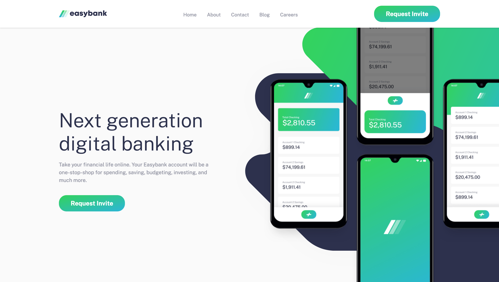

# Frontend Mentor - Easybank landing page solution

This is a solution to the [Easybank landing page challenge on Frontend Mentor](https://www.frontendmentor.io/challenges/easybank-landing-page-WaUhkoDN). Frontend Mentor challenges help you improve your coding skills by building realistic projects.

## 目次

-   [概要](#概要)
    -   [チャレンジ](#チャレンジ)
    -   [スクリーンショット](#スクリーンショット)
    -   [リンク](#リンク)
-   [プロセス](#プロセス)
    -   [使用したスキル](#使用したスキル)
    -   [学んだこと](#学んだこと)
    -   [役に立ったリソース](#役に立ったリソース)

## 概要

### チャレンジ

ユーザーができること:

-   ユーザーの画面サイズによって最適なレイアウトが表示される
-   ページ上の全てのインタラクティブな要素にホバー状態を見ることができる。

### スクリーンショット



### リンク

-   Live Site URL: [リンク](https://kaji1127.github.io/Easybank-Landing-Page/)

## プロセス

### 使用したスキル

-   Vanilla JavaScript
-   CSS カスタムプロパティ
-   Flexbox
-   CSS Grid
-   Sass
-   モバイルファースト

### 学んだこと

overflow:clip の使い方を知ることができた。
'hidden'を使うとボックスのサイズに切り取りできるがスクロールが発生してしまう。
だが'clip'を使うことによって、'hidden'と違いスクロールを発生させないようにできた。

コードスニペット:

```css
&__img-content {
	@include breakpoint(large) {
		overflow-x: clip;
	}
}
```

### 役に立ったリソース

-   [リソース 1](https://developer.mozilla.org/ja/docs/Web/CSS/overflow)
